<div align="center">
<picture>
  <source media="(prefers-color-scheme: dark)" srcset=".github/brand/banner-night.svg">
  
</picture>
<br><br>
<a href="#usage"><picture><source media="(prefers-color-scheme: dark)" srcset=".github/brand/tab-usage-night.svg"></picture></a>
<a href="#license"><picture><source media="(prefers-color-scheme: dark)" srcset=".github/brand/tab-license-night.svg"></picture></a>
</div>

<br>

A collection of Arduino sketches and hardware experiments initialized with `init-arduino.sh`.

<p>
<a name="usage"></a>
<picture><source media="(prefers-color-scheme: dark)" srcset=".github/brand/section-usage-night.svg"></picture>
</p>

Open any `.ino` sketch in the [Arduino IDE](https://www.arduino.cc/en/software) or compile with the Arduino CLI:

```bash
arduino-cli compile --fqbn arduino:avr:uno <sketch>
arduino-cli upload -p /dev/ttyUSB0 --fqbn arduino:avr:uno <sketch>
```

<p>
<a name="license"></a>
<picture><source media="(prefers-color-scheme: dark)" srcset=".github/brand/section-license-night.svg"></picture>
</p>

MIT — see [LICENSE](LICENSE).

<div align="center">
Made with ❤️ by <a href="https://github.com/NoamFav">NoamFav</a>
</div>

<br>

<a href="https://nf-software.com">
<picture>
  <source media="(prefers-color-scheme: dark)" srcset=".github/brand/footer-night.svg">
  
</picture>
</a>
